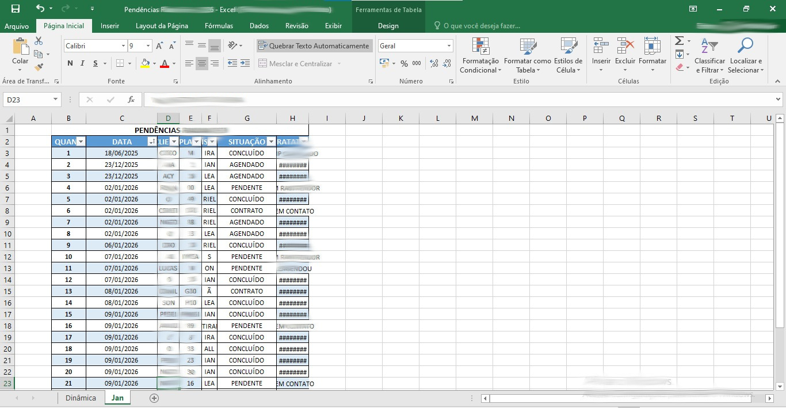
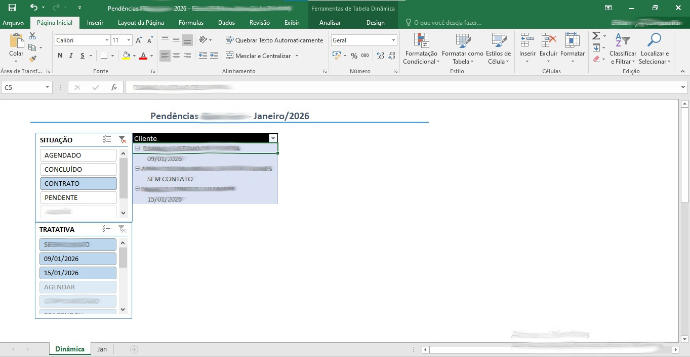

# Análise de Dados Operacionais com Excel

## 📍 Contexto do Problema
No ambiente administrativo, informações operacionais costumam estar dispersas, dificultando o controle de status, o acompanhamento por período e a tomada de decisão.

Este projeto simula um cenário real no qual foi necessário estruturar e consolidar dados para gerar uma visão clara e confiável do processo.

## 🎯 Objetivo da Análise
Desenvolver uma solução em Excel que permitisse:
- Consolidar dados operacionais em uma base única;
- Analisar informações por status, associado e período;
- Apoiar a tomada de decisão de forma rápida e visual.

## 🛠️ Ferramentas e Técnicas Utilizadas
- Microsoft Excel;
- Estruturação e padronização de dados;
- Tabela Dinâmica para análise exploratória;
- Organização visual da informação.

## 📊 Etapas do Projeto
1. Estruturação da base de dados em formato tabular;
2. Padronização de campos (status, datas, identificadores);
3. Criação de tabelas dinâmicas para análise por múltiplos critérios;
4. Ajustes visuais para facilitar interpretação e leitura.

## 📈 Principais Resultados
- Centralização das informações operacionais;
- Redução do tempo necessário para análise manual;
- Visão clara do andamento dos processos;
- Apoio direto à tomada de decisão.

## 🧠 Insights Obtidos
- Identificação de volumes por status;
- Acompanhamento de dados por período;
- Melhor compreensão do fluxo operacional.

  ## 📷 Visualizações do Projeto

### Estrutura da Base de Dados

### Tabela Dinâmica – Visão Geral

## 📎 Observações
Os dados apresentados são fictícios e foram adaptados exclusivamente para fins de portfólio, preservando a lógica de um cenário real.
